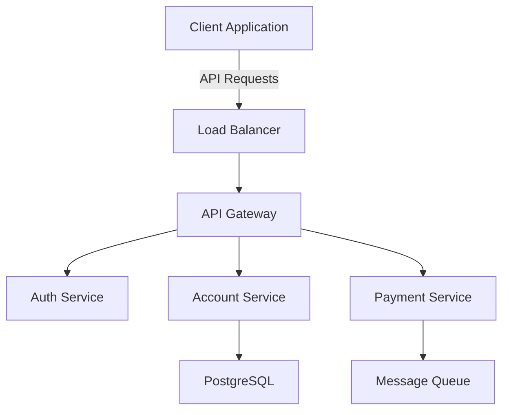

# BANKFIN - API-First Neo-Bank Platform

<div align="center">
  <h3>🏦 Modern Banking Infrastructure for Developers</h3>
  <p>Secure, scalable financial APIs for the modern fintech ecosystem</p>
</div>

<p align="center">
  <a href="#key-features">Features</a> •
  <a href="#quick-start">Quick Start</a> •
  <a href="#api-reference">API Reference</a> •
  <a href="#architecture">Architecture</a> •
  <a href="#security">Security</a> •
  <a href="#development">Development</a>
</p>

## 🌟 Key Features

BANKFIN provides a comprehensive suite of banking APIs designed for modern fintech applications:

### Core Banking
- **Account Management**
  - Virtual & physical account creation
  - Real-time balance tracking
  - Multi-currency support
  - Account hierarchies and grouping

### Payment Processing
- **Multiple Payment Rails**
  - ACH (US domestic transfers)
  - SEPA (European payments)
  - Real-Time Payments (RTP)
  - Wire transfers
  - International remittances

### Compliance & Security
- **Identity Verification**
  - KYC (Know Your Customer)
  - AML (Anti-Money Laundering)
  - Document verification
  - Biometric authentication

### Developer Tools
- **Comprehensive SDK Support**
  - REST APIs with OpenAPI/Swagger specs
  - WebSocket support for real-time updates
  - Webhook notifications
  - Detailed API documentation

## 🚀 Quick Start

### Prerequisites
- Node.js 18.0 or higher
- npm or yarn package manager
- PostgreSQL 13+
- Redis 6+

### Installation

1. Clone the repository:
\`\`\`bash
git clone https://github.com/DingoXxX/BANKFIN.git
cd BANKFIN
\`\`\`

2. Install dependencies:
\`\`\`bash
npm install
\`\`\`

3. Set up environment variables:
\`\`\`bash
cp .env.example .env
# Edit .env with your configuration
\`\`\`

4. Start the development server:
\`\`\`bash
npm run dev
\`\`\`

## 📚 API Reference

### API Documentation
- **OpenAPI/Swagger Specification**
  - Location: \`docs/openapi.yaml\`
  - Interactive documentation available at \`/api/docs\` when running locally

- **Postman Collection**
  - Location: \`docs/postman_collection.json\`
  - Import directly into Postman for testing

### Authentication
```typescript
// Example: API Authentication
const bankfin = new BANKFINClient({
  apiKey: 'your_api_key',
  environment: 'sandbox' // or 'production'
});
```

### Example: Create Virtual Account
```typescript
// Create a new virtual account
const account = await bankfin.accounts.create({
  type: 'virtual',
  currency: 'USD',
  metadata: {
    customer_id: 'cust_123',
    purpose: 'expense_account'
  }
});
```

## 🏗 Architecture

### System Components
- **Backend Stack**
  - Node.js (Express/Koa) for API services
  - PostgreSQL for transactional data
  - Redis for caching and session management
  - RabbitMQ for async processing

### Infrastructure
- **Deployment**
  - Docker containers
  - Kubernetes orchestration
  - Automated scaling
  - Multi-region support

### Integration Points


## 🔒 Security & Compliance

### Security Features
- End-to-end encryption (E2EE)
- Role-based access control (RBAC)
- Multi-factor authentication (MFA)
- Real-time fraud detection

### Compliance Certifications
- SOC 2 Type II
- PCI-DSS Level 1
- GDPR compliant
- ISO 27001

### Audit & Monitoring
- Comprehensive audit logging
- Real-time alerting
- Automated vulnerability scanning
- Regular penetration testing

## 💻 Development

### Local Development
1. Start local services:
\`\`\`bash
docker-compose up -d
\`\`\`

2. Run migrations:
\`\`\`bash
npm run migrate
\`\`\`

3. Start development server:
\`\`\`bash
npm run dev
\`\`\`

### Testing
```bash
# Run unit tests
npm run test

# Run integration tests
npm run test:integration

# Run e2e tests
npm run test:e2e
```

### Code Quality
- ESLint for code linting
- Prettier for code formatting
- Husky for pre-commit hooks
- Jest for testing

## 🤝 Contributing

We welcome contributions! Please see our [Contributing Guide](CONTRIBUTING.md) for details.

1. Fork the repository
2. Create your feature branch
3. Commit your changes
4. Push to the branch
5. Open a pull request

## 📄 License

This project is licensed under the MIT License - see the [LICENSE](LICENSE) file for details.

## 🌐 Links

- [Official Documentation](https://docs.bankfin.dev)
- [API Status](https://status.bankfin.dev)
- [Developer Blog](https://blog.bankfin.dev)
- [Community Forum](https://community.bankfin.dev)

## 📞 Support

- Email: support@bankfin.dev
- Discord: [Join our server](https://discord.gg/bankfin)
- Twitter: [@BANKFINdev](https://twitter.com/BANKFINdev)

---

<div align="center">
  Made with ❤️ by the BANKFIN team
</div>
